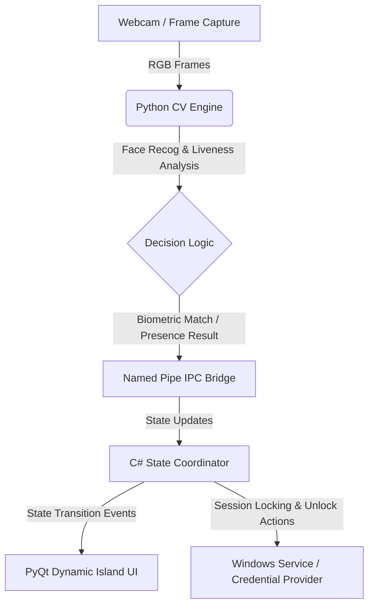

# MajestyGuard

[](https://github.com/onlykushalll/MajestyGuard/actions)
[](https://www.python.org/downloads/)
[](https://dotnet.microsoft.com/download)
[](LICENSE)

MajestyGuard is an experimental Windows security framework that implements a local-first, Face ID-inspired presence verification layer. It combines webcam-based face recognition, passive liveness detection, a desktop soft-lock shield, a Dynamic Island status overlay, and Credential Provider integrations.

---

> [!NOTE]
> **Personal Project Notice**: MajestyGuard is a personal project developed for exploration, learning, and productivity. It is an active research prototype and is not intended as a production security utility or enterprise login replacement.

---

## 🏗️ System Architecture

MajestyGuard utilizes a modular architecture split between a high-performance C#/.NET state coordinator and a Python-based computer vision pipeline.



---

## 📂 Repository Directory Structure

The repository utilizes a flattened layout putting active executables and launchers in the root directory:

```text
MajestyGuard/
├── .github/                   # GitHub Actions workflows & issue/PR templates
├── companion/                 # Windows Hello Companion App (UWP C#)
├── daemon/                    # MajestyGuard Core Python Daemon (IPC, policy audit, monitors)
├── ui/                        # Dynamic Island UI & Soft-Lock overlay (PyQt)
├── setup/                     # PowerShell install/uninstall scripts
├── src/                       # Source files for C# modules
│   ├── MajestyGuard.Core/     # Core state machine, security vaults, IPC models
│   ├── MajestyGuard.Service/  # Windows service background host
│   ├── MajestyGuard.Overlay/  # Custom WinUI desktop overlay
│   ├── MajestyGuard.CVEngine/ # CV pipeline and face recognition module
│   └── MajestyGuard.CredentialProvider/ # Credential Provider DLL (C++)
├── tests/                     # Integration and path safety tests
├── tools/                     # Legacy diagnostics & stubs
├── docs/                      # Technical plans, reports & operational manuals
├── LICENSE                    # MIT License
└── requirements.txt           # Python dependency file
```

---

## 📚 Technical Documentation & Specifications

Detailed architectural documents, lock screen plans, and code-signing roadmaps are organized under the `docs/` folder:

* **[System Architecture & Visual Design](file:///c:/tmp/MajestyGuard/docs/design/ARCHITECTURE_AND_DESIGN.md)**: Deep dive into the multi-process named pipe topology, 12-layer biometric liveness engine, state machine, and Apple Dynamic Island-styled visual design specifications (HSL palettes, typography, spring-physics animations).
* **[Lock Screen & OS Integration Guide](file:///c:/tmp/MajestyGuard/docs/guides/LOCK_SCREEN_INTEGRATION.md)**: Guide on soft lock overlays vs. hardware lock screens, C++ COM Credential Provider DLL integration details, named pipe broker protocol schema, and the Windows Hello Companion Device Framework (WHCDF) onboarding plan.
* **[Code Signing Roadmap & Release Checklist](file:///c:/tmp/MajestyGuard/docs/signing/CODE_SIGNING_AND_RELEASES.md)**: Roadmap for trusted Authenticode signatures (SignPath Foundation, Azure Trusted Signing), SignPath eligibility reviews, draft privacy/signing policies, and the required pre-release validation checklist.

---

## 🛠️ Build & Installation

### Requirements
* Windows 11
* .NET SDK 8
* Python 3.11 (configured in path)
* Visual Studio Build Tools with C++ workloads

### Verification Build
To build C# dependencies and run unit tests:
```powershell
dotnet restore .\MajestyGuard.sln
dotnet test .\src\MajestyGuard.Tests\MajestyGuard.Tests.csproj
```

To configure the Python computer vision engine:
```powershell
cd src\MajestyGuard.CVEngine
python -m venv .venv
.\.venv\Scripts\Activate.ps1
pip install -r requirements.txt
```

To run Python daemon unit tests:
```powershell
# Run from repository root
pytest daemon/
```

---

## 🔍 Troubleshooting Guide

### 1. Platform Setup & Operating System Issues
* **Smart App Control (SAC) / Defender Blocks**: Windows Smart App Control may block unsigned binaries or the virtual environment's executables. 
  * *Solution*: Configure developer mode on Windows or build inside a user-writable directory (e.g. `C:\tmp\MajestyGuard`). Verify tests by invoking pythonw through the active virtual environment explicitly.
* **C++ Compilation Errors**: Errors building `MajestyCredentialProvider.vcxproj` during packaging.
  * *Solution*: Ensure the "Desktop development with C++" workload is installed in the Visual Studio Installer.

### 2. Runtime Errors
* **Camera Access Conflicts**: The Python daemon fails to startup, logging `Camera initialization failed`.
  * *Solution*: Close any zoom, teams, or browser applications utilizing the webcam. Verify that camera access is enabled under *Windows Privacy & Security Settings -> Camera*.
* **Named Pipe IPC Connections Timeouts**: The PyQt UI overlay or daemon fails to sync state, throwing pipe connection failures.
  * *Solution*: Ensure coordinate services are launched in sequence. The daemon (`run_daemon.bat`) must be started, which initializes the named pipe server, prior to starting the UI (`run_ui.bat`).

### 3. Driver & Device Fallbacks
* **Media Foundation Failures**: OpenCV throws DirectShow or MSMF grab warnings on laptops with multi-sensor arrays.
  * *Solution*: Force DirectShow backend by setting `OPENCV_VIDEOIO_PRIORITY_MSMF=0` as an environment variable, or modify the camera index config in the settings.
* **DPAPI Decryption Failures**: UWP companion app fails to persist keys or registers registration status failures.
  * *Solution*: Run `setup/setup_whcdf.ps1` with elevated Administrator privileges to provision credential vaults and register permissions.

---

## 🛡️ License

MajestyGuard is released under the [MIT License](LICENSE).
